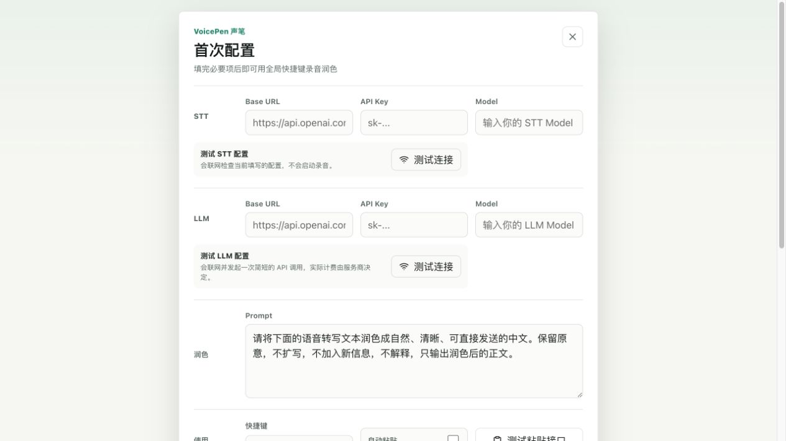

<p align="center">
  
</p>

<p align="center">
  <strong>按下快捷键，说话，得到可以直接发送的文字。</strong><br>
  <sub>VoicePen 会完成录音、AI 转写与润色，并复制到剪贴板或粘贴到当前输入框。</sub><br><br>
  <sub>macOS 10.15+ · 自带 STT / LLM 服务 · 配置保存在本机 · Windows 版开发中</sub><br><br>
  <a href="https://github.com/anjing-le/anjing-voicepen/releases/latest"><strong>下载 macOS</strong></a>
</p>

<p align="center">
  <sub>macOS 安装包未经 Apple 公证，首次打开请前往“系统设置 → 隐私与安全性 → 仍要打开”。</sub>
</p>

<details>
<summary>开发构建</summary>

开始前请安装 [Tauri 2 前置依赖](https://v2.tauri.app/start/prerequisites/)（Node.js、Rust 及当前系统依赖）；完整验证要求见 [参与贡献](CONTRIBUTING.md)。

```bash
npm install
npm run tauri:dev
```

</details>

[架构](docs/ARCHITECTURE.md) · [发布与更新](docs/RELEASE_STRATEGY.md) · [参与贡献](CONTRIBUTING.md) · [MIT](LICENSE)
